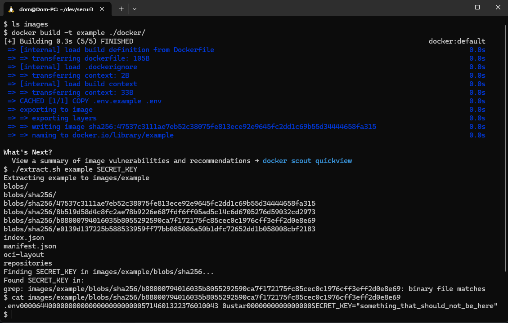

# Proof of Concept - Docker Image Secret Extraction

This repository explores why "secrets" should not be stored in Docker images.
This is **a feature of Docker**, rather than an exploit or vulnerability, but a
regularly overlooked security risk that can be used to bypass other
authentication that may have been configured in your application.

Alongside this theoretical exploration, this repository contains proof of
concept code that can be used to extract "secret" files from a Docker image in
varying ways.

## Introduction

After reading that "best practice" suggests that one should never put any
secret or credentials in the Dockerfile instructions (environment variables,
args, or hard coded into any command) (Álvaro Iradier, 2021)[^dockerfile-best-practices] and seeing how
often this practice is ignored, I questioned how easy it would be to extract
secrets from a Docker image.



## The Problem

One way that secrets tend to be stored into a Docker image is through
copying sensitive files into the image, whether by mistake, due to naivety, or
for "ease of use". Fundamentally, this issue is described by [CWE-798: Use of
Hard-coded Credentials][cwe-798-harcoded-credentials] in that hard-coded
credentials typically create a significant hole that allows an attacker to
bypass the authentication that has been configured (Mitre.org, 2020)[^cwe-798].

Secrets could be stored into a Docker image by copying your `.env` file into the
image, or by copying a private key, or other similar credentials, into the
image - but the steps to reverse this process and extract the secrets copied
into the image are simple.

[cwe-798-harcoded-credentials]: https://cwe.mitre.org/data/definitions/798.html

## The Impact

Research by RWTH Aachen University in Germany, analysing `337,171` images and
`1,647,300` layers, found that `8.5%` images analysed contained valid secrets.
(Dahlmanns et al., 2023)[^image-secrets-paper].

Some high-profile security events that can be attributed to the exploitation of
secrets stored in Docker images include the [Codecov breach in January
2021][codecov-breach] and the [case study of Google Cloud's
Apigee][gcp-apigee-exploit].

In the case of Codecov, credentials exported from a Docker image were used to
launch a man-in-the-middle attack on Codecov's infrastructure and further
exfiltrate the environment variables of some of Codecov's 23,000 customers
(Jackson, 2021)[^codecov-breach] - and, consequentially, large organizations such as Twilio,
Hashicorp, Rapid7, Confluent have released their own statements about how this
has affected them. (Jackson, 2021)[^codecov-breach]

Similarly, in the case of Apigee it was found that Aside from a number of other
bugs found by analysing the source code (SSRFs, path traversals, authorization
bypasses and more), the image included several hard-coded passwords, which
turned out to be re-used in production. (August, 2023)‌‌‌[^apigee-case] As a result of these
findings, the researcher was able to gain access to Google's own Apigee
instance.

[codecov-breach]: https://about.codecov.io/security-update/
[gcp-apigee-exploit]:
  https://www.binarysecurity.no/posts/2023/04/secrets-in-docker-images

## Why It Matters

The security concept of Least Privilege asserts that a user or entity should
only have access to the specific data, resources and applications needed to
complete a required task. (Palo Alto Networks, 2015)[^least-privilege-explanation] which,
consequentially, helps to reduce attack surface and attack spread. By storing
secrets in Docker images, it becomes possible to bypass other security
procedures without the need for them to be compromised, nor for the attacker to
escalate their privileges.

Alongside this, a pillar of zero-trust security is the assumption that there
are attackers both within and outside of the network, so no users or machines
should be automatically trusted. (Cloudflare.com, 2021)[^zero-trust-explanation]

By leaving such such a security hole in your application, any RBAC or other
procedures that you have in place to protect your application are bypassed and
Docker repository access could be utilised to compromise production systems
and infrastructure.

### My Docker Repository is Private, So It's Safe, Right?

In the case of Apigee, this was accidentally not the case - a Docker registry
was available on docker.apigee.net, which allowed unauthenticated users to pull
the Apigee Edge Docker image (August, 2023)‌‌‌[^apigee-case]. This is the kind of small
oversight that can have large consequences. It is one issue to accidentally
expose the source code of your application - whereas exposing the critical
secrets of the application alongside it gives an attacker both the lock and the
key and potentially full control for whatever intent they might have.

Regardless of the privacy of the Docker Repository, accidental public exposure
of the Docker repository is not the only way that a Docker image, and thus the
secrets within it, may be accessed or exposed: (August, 2023)‌‌‌[^apigee-case]

- Images are pulled to developer’s machines, stored and forgotten. These
  machines can be hacked, lost and stolen, kept after employee quits.
- If a single application running an image from a private registry is
  compromised, all the images in the registry may leak as the system running the
  application often has pull privileges on the registry.

To apply the principles of zero-trust security, one should assume that the
system, in this case the Docker Repository, has already been compromised and
thus take steps to ensure that there is the least amount of impact possible if
such a compromise were to occur.

## What Can Be Done?

If you need to store secrets in your Docker image, it is recommended that you
use a secret management system to store and retrieve these secrets. This allows
you to keep your Docker image free of sensitive information and allows you to
rotate secrets without needing to rebuild your Docker image.

Ideally, secrets should be stored in a cryptographic secret vault and loaded
when needed (August, 2023)‌‌‌[^apigee-case] and such a solution can be implemented using
tools such as [HashiCorp Vault][hashicorp-vault], [AWS Secrets
Manager][aws-secrets-manager], [Google Cloud Secret
Manager][gcp-secret-manager], or [Azure Key Vault][azure-key-vault].

As an additional preventative step, you can prevent files from accidentally
winding up on your image by adding them to the `.dockerignore` file. For
example, if you’re worried about accidentally adding SSH keys to your image, you
can include: `*id_rsa*` (Cotton, 2023)[^protecting-docker-secrets]

[hashicorp-vault]: https://www.hashicorp.com/products/vault
[aws-secrets-manager]: https://aws.amazon.com/secrets-manager/
[gcp-secret-manager]: https://cloud.google.com/security/products/secret-manager
[azure-key-vault]: https://azure.microsoft.com/products/key-vault

## Related Issues

- [InfoSecurity Magazine's Article on "Secrets Spilled Via Public GitHub
  Repositories"][infosec-mag-secrets-leaked]
- [GitGuardian's Article on Dealing with Hardcoded
  Secrets][gitguardian-hardcoded-secrets]
- [CWE Category: Credentials Management Errors][cwe-category-255]

[infosec-mag-secrets-leaked]:
  https://www.infosecurity-magazine.com/news/13-million-secrets-public-github/
[gitguardian-hardcoded-secrets]:
  https://blog.gitguardian.com/why-its-urgent-to-deal-with-your-hard-coded-credentials/
[cwe-category-255]: https://cwe.mitre.org/data/definitions/255.html

## Best Practices and Resources

> Note: Please feel free to submit a PR to add to this list of resources!

- [OWASP's Cheatsheet on Docker Security][owasp-docker-security]
- [Docker's advice on Security Best Practices][docker-best-practices]
- [Spacelift's Docker Security Best Practices][spacelift-docker-security]
- [OWASP WrongSecrets Repository][owasp-wrongsecrets]
- [NestJS Secret Manager Example][nestjs-secret-manager-example]

[owasp-docker-security]:
  https://cheatsheetseries.owasp.org/cheatsheets/Docker_Security_Cheat_Sheet.html
[docker-best-practices]:
  https://docs.docker.com/develop/security-best-practices/
[spacelift-docker-security]: https://spacelift.io/blog/docker-security
[owasp-wrongsecrets]: https://github.com/OWASP/wrongsecrets
[nestjs-secret-manager-example]: https://bitbucket.org/nikhil-simform/secret-manager

## Usage

Alongside this exploration, this repository contains some simple scripts that
demonstrate the extraction of secrets and values from a Docker image.

```bash
# Find "SECRET_KEY" in the image without running the image
$ ./extract.sh <image> "SECRET_KEY"
# ...
Found something_that_should_not_be_found in:
grep: images/<image>/blobs/sha256/...
```

## Credits and Acknowledgements

CC-BY-4.0 © 2024 [Dom Webber](https://domwebber.dev)

## References

[^dockerfile-best-practices]:
    Álvaro Iradier (2021). _Top 20 Dockerfile best practices._ [online] Sysdig.
    Available at: <https://sysdig.com/blog/dockerfile-best-practices/> [Accessed
    28 Mar. 2024].

[^cwe-798]:
    Mitre.org. (2020). CWE - CWE-798: Use of Hard-coded Credentials (4.14).
    [online] Available at: <https://cwe.mitre.org/data/definitions/798.html>
    [Accessed 31 Mar. 2024].

[^image-secrets-paper]:
    Dahlmanns, M., Sander, C., Decker, R. and Wehrle, K. (2023). Secrets
    Revealed in Container Images: An Internet-wide Study on Occurrence and
    Impact. Proceedings of the ACM Asia Conference on Computer and
    Communications Security. [online]
    doi:<https://doi.org/10.1145/3579856.3590329>.

[^codecov-breach]:
    Jackson, M. (2021). Codecov supply chain attack breakdown. [online]
    GitGuardian Blog - Code Security for the DevOps generation. Available at:
    <https://blog.gitguardian.com/codecov-supply-chain-breach/> [Accessed 31
    Mar. 2024].

[^apigee-case]: August, C. (2023). Why you shouldn’t include secrets in Docker images, a
Google Cloud case study. [online] Binary Security AS. Available at:
<https://www.binarysecurity.no/posts/2023/04/secrets-in-docker-images> [Accessed
31 Mar. 2024].

[^least-privilege-explanation]:
    Palo Alto Networks. (2015). What Is the Principle of Least Privilege?
    [online] Available at:
    <https://www.paloaltonetworks.com/cyberpedia/what-is-the-principle-of-least-privilege>
    [Accessed 31 Mar. 2024].

[^zero-trust-explanation]: Cloudflare.com. (2021). Zero Trust security | What is a Zero Trust
network? [online] Available at:
<https://www.cloudflare.com/en-gb/learning/security/glossary/what-is-zero-trust/>
[Accessed 31 Mar. 2024].

[^protecting-docker-secrets]: Cotton, B. (2023). Protecting Secrets with Docker | Docker. [online]
Docker. Available at:
<https://www.docker.com/blog/protecting-secrets-with-docker/> [Accessed 31 Mar.
2024].
